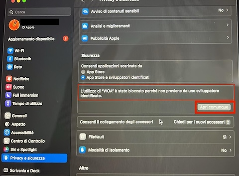

# woa-electron-vite-app

An Electron application with React

## Recommended IDE Setup

- [VSCode](https://code.visualstudio.com/) + [ESLint](https://marketplace.visualstudio.com/items?itemName=dbaeumer.vscode-eslint) + [Prettier](https://marketplace.visualstudio.com/items?itemName=esbenp.prettier-vscode)

## Quick setup

- Clone master branch

- ```npm install```

- When the locator DB screen starts, select an empty sample db loacated at data/woa-emtpy.db

## Project Setup

### Install

```bash
$ npm install
```

### Development

```bash
$ npm run dev
```

### Build

```bash
# For windows
$ npm run build:win

# For macOS
$ npm run build:mac

# For Linux
$ npm run build:linux
```

### Scaffolding the project
- App scaffolding with [Electron-vite](https://electron-vite.org/guide/)
```
npm create @quick-start/electron@latest
```

- Install [Tailwindcss](https://tailwindcss.com/docs/installation/using-vite)
```
npm install tailwindcss @tailwindcss/vite
```
add tailwindcss plugin into electron.vite.config.mjs
```
...
import tailwindcss from '@tailwindcss/vite'
.....
    plugins: [
      react(),
      tailwindcss(),
    ]
...
```

- Install better-sqlite3 and [Rebuild better-sqlite3 agianst current Node](https://dev.to/arindam1997007/a-step-by-step-guide-to-integrating-better-sqlite3-with-electron-js-app-using-create-react-app-3k16)
```
npm install better-sqlite3
npm install --save-dev electron-rebuild
```
After the installation is completed, add this to your package.json
```
{   
    ...
    "scripts": {
        ...             
        "rebuild-sqlite3": "electron-rebuild -f -w better-sqlite3",
    }
}
```

- Init Git Repo
```
git init
```

- Add following dependencies
```
npm install electron-log
npm install --save-dev tailwindcss @tailwindcss/vite
npm install --save-dev react-router-dom
npm install --save-dev react-toastify
```

- Configure [Tailwindcss](https://tailwindcss.com/docs/installation/using-vite) in electron.vite.config.mjs

## Project Run

First initialization from remote repo
```
git clone https://github.com/crixo/woa-electron-vite-app.git
npm install
npm run rebuild-sqlite3
npm run dev
```

## Rebuild project for apecific arch

- Dowload repo into a specific folder for the target platform e. mac amd 
```
git clone https://github.com/crixo/woa-electron-vite-app.git woa-electron-vite-app-{platform}
```
-- Install dependedencies
```
npm install
```

-- Rebuild dependencies for the specific paltform (not needed - only for native module as next step)
```
npm rebuild --arch=x64 --platform=darwin
```

-- Rebuilds native modules for Electron.
```
npm run rebuild-sqlite3
```

-- Build the Electron App for x64 (AMD/Intel)
```
npm run build:mac-universal
```

- Once built, you can check whether the binary arch by running:
```
file /path/to/app.app/Contents/MacOS/app-binary
```
or
```
lipo -info /path/to/app.app/Contents/MacOS/app-binary
```

## Signing
- find the name of signing certificate and electron-build log for identity value 
```
security find-identity -v -p codesigning
```

- Sign app manually after bundle
```
codesign --deep --force --verbose --sign - ./dist/mac-arm64/woa-electron-vite-app.app 
or a self-signed cert generated via keychain
codesign --deep --force --verbose --sign "CrixoDev" ./dist/mac-arm64/woa-electron-vite-app.app 
```

- Verify signing 
```
codesign --verify --verbose /path/to/app.app
```
Verify who signed
```
codesign -dv --verbose=4 /path/to/app.app
```

## Fix unsigned app
If Gatekeeper will show warnings like “This app cannot be opened because it is from an unidentified developer.”, Users must manually approve the app
- Open the app manually via Terminal
```
open /path/to/YourApp.app
```
This might still trigger Gatekeeper warnings, but it attempts to launch the app.

- Verify if attributes are present
```
xattr ~/Applications/WOA.app
```
get more detials about quarantine flag
```
xattr -p com.apple.quarantine /path/to/YourApp.app
```
- Remove the Attributes
```
sudo xattr -rd com.apple.quarantine ~/Applications/WOA.app
```

For previous version of Mac you can add the app in the trusted list of Gatekeeper
```
sudo spctl —-add —-label “WOA” ~/Applications/WOA.app
sudo spctl —-enable —-label “WOA”
```
For new OS wersion you can only remove quarantine flag after each update. See src/main/electron-updater.js:
```
autoUpdater.on('update-downloaded'...
....
exec(`xattr -d com.apple.quarantine "${appBundlePath}"`, (error) => {...
```


- Check the Gatekeeper status with:
```
spctl --status
```

If it's enabled, you can disable Gatekeeper temporarily (Not recommended for long-term security reasons!):
```
sudo spctl --master-disable
```

- Alternatively you can use the UI as well **but you need to repeat it on each relese**

System Settings -> Privacy & Security In the Security section you'll see a box for the WOA app you previously tried to open with a button to unlock it



## Create new Release

- Make sure the are no uncommited or unpushed file on the master branch. Build should be made from master branch for long-term releases.

- Create a build making sure "prebuild<script-name>" is enabled to increase automatically the application version in package.json. Make sure your are signing the code with a valid certificate, also a self-signed, to allow auto-update procedure. Verify in the build logs the signing procedure succeded with the following message:
```
signing         file=dist/mac-arm64/WOA.app platform=darwin type=distribution identity=XXX provisioningProfile=none
```
For standard/local build for mac arch use
```
npm run build:mac
```

- Create a final commit asociated to the build just executed. The build increased the version into the package json.

- Create git Tag create an annotated (recommended for releases because it includes metadata). As convention matching the Build just created as per in package.json.version
```
git tag -a vX.X.X -m "Release version X.X.X"
```

- Push the Tag to git
```
git push origin vX.X.X
```

- Go to git repo and [create the Release](https://github.com/crixo/woa-electron-vite-app/releases/new) as draft selecting the tag just created

- Attach to the draft release the following files created by the build process into the dist/ folder
    - latest-mac.yml
    - woa-electron-vite-app-X.X.X-arm64-mac.zip
    - woa-electron-vite-app-X.X.X-arm64-mac.zip.blockmap
    - woa-electron-vite-app-X.X.X.dmg
    - woa-electron-vite-app-X.X.X.dmg.blockmap

- Review the Release in Git and publish it using "Publish Release" button

## AI
- Installing the [model](https://cheatsheet.md/llm-leaderboard/how-to-run-mistral-locally.en)


## Note

- [DaisyUI](https://yon.fun/top-tailwind-component-libs/)

## Logbook

- Use BrowserRouter works w/ Electron final package (win, mac, ..) BrowserRouter does not. BrowserRoute works only in dev mode.

- verify the date format used by local app when a date is selected with html datepicker

- dates from (old) DB are stored w/ time as 00:00:00. New app will save it w/o time. Time portion is handled in utils.formatDate while loading the date.

